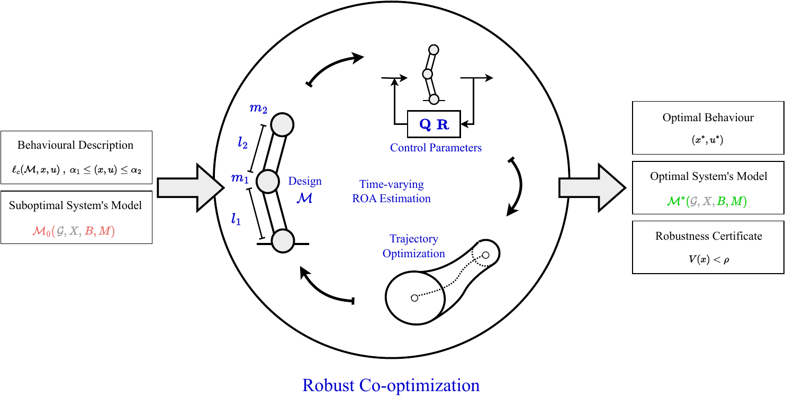
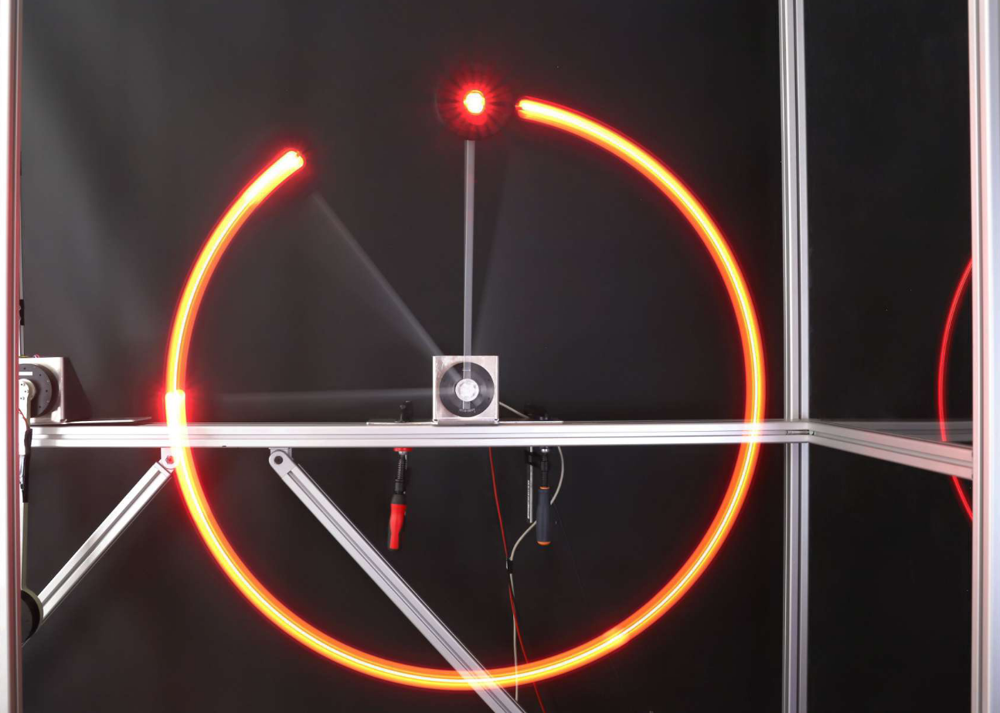
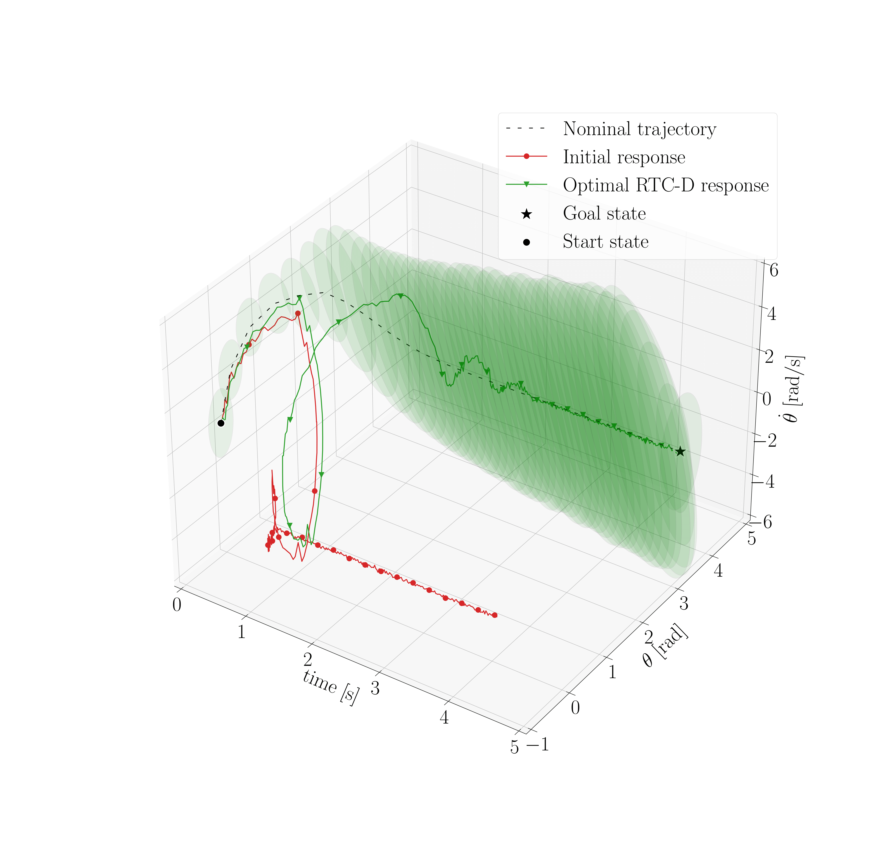
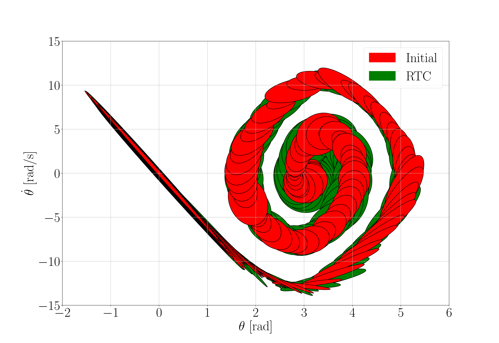
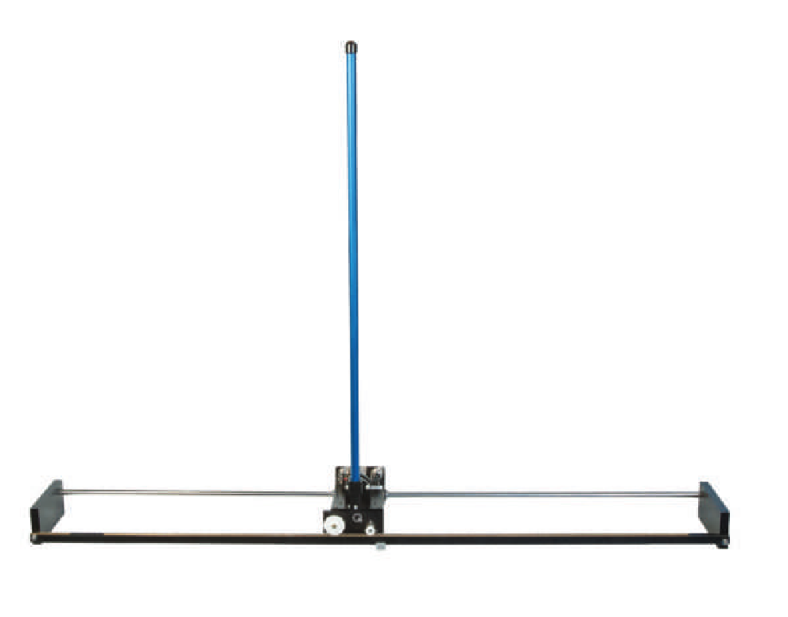
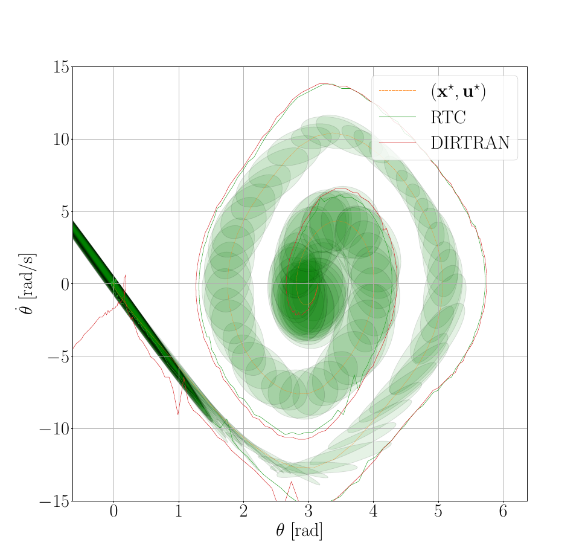

# Robust Co-Design of Canonical Underactuated Systems for Increased Certifiable Stability

This repository contains the code, data and plots of the paper "Robust Co-Design of Canonical Underactuated Systems for Increased Certifiable Stability". The paper has been submitted at the [ICRA 2024 Conference](https://2024.ieee-icra.org/). 

### Abstract
Optimal behaviours of a system to perform a specific task can be achieved by leveraging the coupling between trajectory optimization, stabilization and design optimization. This approach proves particularly advantageous for underactuated systems, which are systems that have fewer actuators than degrees of freedom and thus require for more elaborate control systems. This paper proposes a novel co-design algorithm, namely Robust Trajectory Control with Design optimization
(RTC-D). An inner optimization layer (RTC) simultaneously performs direct transcription (DIRTRAN) to find a nominal trajectory while computing optimal hyperparameters for a stabilizing time-varying linear quadratic regulator (TVLQR). RTC-D augments RTC with a design optimization layer, maximizing the system’s robustness through a time-varying Lyapunov-based region of attraction (ROA) analysis. This analysis provides a formal guarantee of stability for a set of off-nominal states. 

The proposed algorithm has been tested on two different underactuated systems: the torque-limited simple pendulum and the cart-pole. Extensive simulations of off-nominal initial conditions demonstrate improved robustness, while real-system experiments show increased insensitivity to torque disturbances.

### Content
In the [examples](examples) folder the user can find all the code necessary to generate the data and plots that have been included in the paper.
Running

    python examples/simple_pendulum/resultsPlots.py
    python examples/cart_pole/resultsPlots.py 

will show the final results of our approach. The main algorithm RTC-D and it's reduced version RTC are implemented for each system in the *rtc_CMAES.py* and *rtcd_CMAES.py* files respectively.

A set of example code is provided both for [simple pendulum](examples/simple_pendulum/) and [cart-pole](examples/cart_pole/). Both the simulated and the experimental verification of the obtained results can be visualized by running the *verificationPlots.py* script. ROA estimation examples are implementedted in the *lqr_roa.py* and *tvlqr_roa.py* files. Also, a direct transcription trajectory optimization is included in a specific file named *dirtran.py*.

### Installation
The use of a virtual environment for the installation is suggested as a common good programming choice. For example, the use of *pipenv* requires the following commands

    pipenv shell
    pipenv install software/python
    pipenv install 'drake==1.5.0'    

### Results
Torque-limited simple pendulum:

Cart-pole:

<!-- ### Citation
Maywald, Lasse & Wiebe, Felix & Kumar, Shivesh & Javadi, Mahdi & Kirchner, Frank. (2022). Co-optimization of Acrobot Design and Controller for Increased Certifiable Stability. 10.13140/RG.2.2.36436.07043.

    @misc{maywald2022,
    author = {Maywald, Lasse and Wiebe, Felix and Kumar, Shivesh and Javadi, Mahdi and Kirchner, Frank},
    year = {2022},
    month = {07},
    pages = {},
    title = {Co-optimization of Acrobot Design and Controller for Increased Certifiable Stability},
    doi = {10.13140/RG.2.2.36436.07043}
    } -->

### Aknowledgements
Code contained in [software/python](software/python/) has been inspired by pre-existing software of DFKI GmbH. It's usage has been agreed with the owner. 

  
  
  

