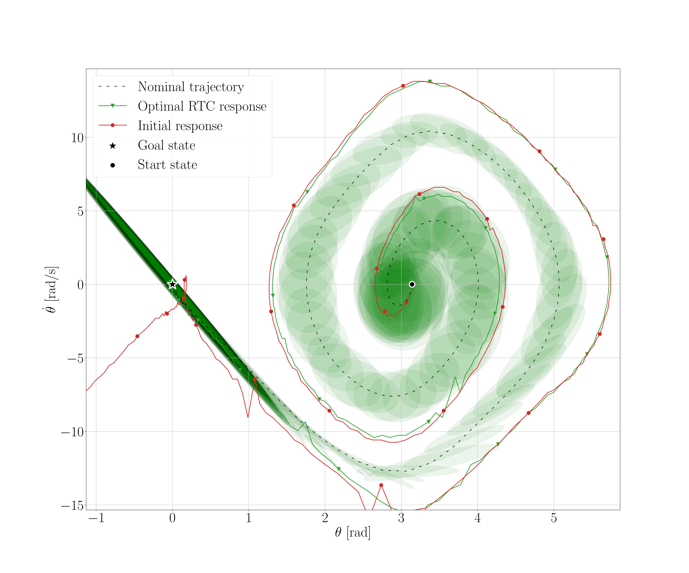

## Introduction
Different living organisms have evolved diverse locomotion strategies and physical characteristics to adapt to their unique environments. Similarly, for underactuated systems a combined optimization of structural parameters and motion control is important to effectively accomplish the desired tasks. A design optimization tunes the system's hardware parameters, such as link lengths or the  center of mass position, of a system to allow for executing the described task with the desired behaviour. For trajectory tracking control, reaching the goal requires to search for a motion trajectory and to compute the control policy that permits the closed-loop trajectory following. Typically, the best trajectory is obtained via a trajectory optimization step, while the control input is computed by a specifically defined controller. A traditional approach to find the best trade-off between mechanical design and motion planning is to iterate between the two processes. Instead, concurrent design aims to automate this process by numerically optimizing both the motion and design parameters, a strategy that has demonstrated superior results. Recent studies in the literature are incorporating non-idealities, such as measurement noise and parameter variations, into co-optimization processes to reduce discrepancies between theoretical predictions and real-world performance.
This paper proposes a novel two layered gradient-free co-design algorithm, namely RTC-D. The process involves co-optimization among the cost matrices of a TVLQR controller, the desired trajectory provided by DIRTRAN, and the system's design parameters. It aims to improve the real-world applicability of the combined optimization result by leveraging the volume of an estimated time-varying ROA. To the best knowledge of the authors this metric has not been studied in this context. We employ the CMA-ES optimization strategy to determine the optimal decision variables.

<figure>
  
  <figcaption>Fig.1 - Robust co-optimization for the optimal fitness of the desired motion.</figcaption>
</figure> 

## Results and Discussion
Our approach has been rigorously tested on two different canonical underactuated systems: the torque-limited simple pendulum and a cart-pole. These systems are inherently underactuated, demanding a robust control approach. The specific case study involves the swing-up problem, consisting in stabilizing the pole in it's up-right position. We validate our results through extensive simulations of the system’s closed loop dynamics, assessing the stabilizability of off-nominal initial conditions.

<figure>
  
  
  <figcaption>Fig.2 - Funnel volume increasing due to RTC for Cart-pole (left) and comparison between RTC and RTC-D optimization  for Simple pendulum (right).</figcaption>
</figure>

Also, experimental verification on the real systems has been implemented. An impulsive torque disturbance has been introduced to check the controller's robustness. 
The robots were tested in two different conditions:
<ul>  
  <li>Initial situation, before the optimization</li>
  <li>Optimal scenario, using the algorithm results</li>
</ul>

<figure>
  
  
  <figcaption>Fig.3 - Experimental verification of stability guarantee (green funnel) given by the RTC for Cart-pole (left) and RTC-D for Simple pendulum (right).</figcaption>
</figure>

Real-system experiments show increased insensitivity to torque disturbances. The optimal configuration (RTC and RTC-D) manages to achieve the desired final stabilization where the initial one does not.

<video src="video/ExperimentCP.mp4" controls="controls" autoplay="autoplay" style="max-width: 48em;" loop="loop">
Your browser does not support the video tag.</video>
<video src="video/ExperimentSP.mp4" controls="controls" autoplay="autoplay" style="max-width: 48em;" loop="loop">
Your browser does not support the video tag.</video>

##### Copyright

Copyright on the material in this webpage has been transferred to IEEE for ICRA 2024: F. Girlanda, L. Maywald, S. Kumar and F. Kirchner, "Robust Co-Design of Canonical Underactuated Systems for Increased Certifiable Stability," 2024 IEEE International Conference on Robotics and Automation, Yokohama, Japan, 2024 <!-- , doi: TBD . -->

A pre-print is now available in arxiv, you can cite it with the following BibTeX citation:

@misc{girlanda2024robust,   
  title={Robust Co-Design of Canonical Underactuated Systems for Increased Certifiable Stability},   
  author={Federico Girlanda and Lasse Shala and Shivesh Kumar and Frank Kirchner},  
  year={2024},  
  eprint={2403.10966},  
  archivePrefix={arXiv},  
  primaryClass={cs.RO}  
  }