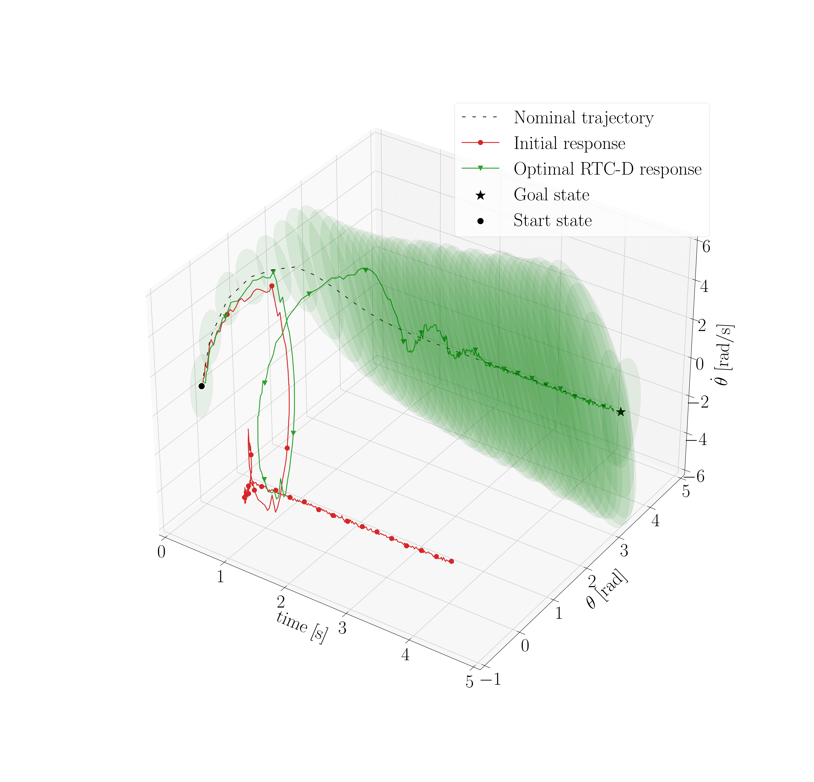

## Introduction
Optimal behaviours of a system to perform a specific task can be achieved by leveraging the coupling between trajectory optimization, stabilization, and design optimization. This approach is particularly advantageous for underactuated systems, which are systems that have fewer actuators than degrees of freedom and thus require for more elaborate control systems. This paper proposes a novel co-design algorithm, namely Robust Trajectory Control with Design optimization (RTC-D). An inner optimization layer (RTC) simultaneously performs direct transcription (DIRTRAN) to find a nominal trajectory while computing optimal hyperparameters for a stabilizing time-varying linear quadratic regulator (TVLQR). RTC-D augments RTC with a design optimization layer, maximizing the system's robustness through a time-varying Lyapunov-based region of attraction (ROA) analysis. This analysis provides a formal guarantee of stability for a set of off-nominal states.

<figure>
  
  <figcaption>Fig.1 - Robust co-optimization for the optimal fitness of the desired motion.</figcaption>
</figure> 

## Results and Discussion
The proposed algorithm has been tested on two different underactuated systems: the torque-limited simple pendulum and the cart-pole.

<figure>
  
  
  <figcaption>Fig.2 - Funnel volume increasing due to RTC for Cart-pole (left) and comparison between RTC and RTC-D optimization  for Simple pendulum (right).</figcaption>
</figure>

Extensive simulations of off-nominal initial conditions demonstrate improved robustness, while real-system experiments show increased insensitivity to torque disturbances.
The experiment...

The robot was tested in two different conditions:
<ul>  
  <li>Initial situation,</li>
  <li>Optimized scenario.</li>
</ul>

<figure>
  
  
  <figcaption>Fig.3 - Experimental verification of stability guarantee (green funnel) given by the RTC for Cart-pole (left) and RTC-D for Simple pendulum (right). The optimal configuration (RTC and RTC-D) manages to achieve the desired final stabilization where the initial one does not.</figcaption>
</figure>

Increased robustness...

<!-- <table>
  <tbody>
    <tr align="center" valign="center">
      <td>
        <figure>
          
          <figcaption>Fig.3 - Measured footsteps for fast walking</figcaption>
        <figure>
      </td>
      <td>
        </figure>
          
          <figcaption>Fig.4 - Measured vertical GRF while stepping in place</figcaption>
        </figure>
      </td>
    </tr>
    <tr align="center" valign="center">
      <td>
        <figure>
          
          <figcaption>Fig.5 - Measured CoP on fastest walk</figcaption>
        </figure>
      </td>
      <td>
        <figure>
          
          <figcaption>Fig.6 - Measured footsteps for long stride walk</figcaption>
        </figure>
      </td>
    </tr>
  </tbody>
</table> -->